.. _TRIALS:

===================
Configuration Files
===================

Configuration files are described in the YAML format. YAML is a human-readable data serialization format. It is commonly used for configuration files and in applications where data is being stored or transmitted. For more information on YAML, see the `YAML website <https://yaml.org/>`_.

--------------------
Sensor Configuration
--------------------

The sensor configuration file is defined by the competitor and describes the location of sensors added to the competition environment. One example of a sensor configuration file :file:`sensors.yaml` is provided in the test competitor package in the config directory. 

:numref:`sensor-config` shows an example of a sensor configuration file with one of each of the different possible sensors. 

The first field in the yaml file is :yamlname:`robot_cameras`. This is an optional field in the sensor configuration file. If this field is not present in the file cameras will not be activated. Alternatively the :yamlname:`active` field can be used to enable or disable a camera for either robot. Last the :yamlname:`type` field should be either :yaml:`rgb` or :yaml:`rgbd`.

The second field in the configuration file is :yamlname:`static_sensors`. This field should contain all the static sensors that the competitor wants to add. Static sensors each have four fields:

  1. A name (e.g. :yamlname:`right_bins_camera`). This name has to be unique among all sensors in the same configuration file.

  2. A type (e.g. :yamlname:`rgb_camera`). This type has to be one of the following types described in the section :ref:`STATIC_SENSORS`.

  3. A pose defined in the world frame:

    * A position :yamlname:`xyz`. This should be a list with three elements representing the x, y, and z coordinates for the sensor origin.

    * An orientation :yamlname:`rpy`. This should be a three element list containing the roll, pitch and yaw of the sensor using `this convention <https://en.wikipedia.org/wiki/Euler_angles>`_ . The orientation should be defined in radians using either floating-point values or with the :yaml:`pi` constant (:yaml:`pi`, :yaml:`pi/2`, :yaml:`pi/4`, etc). 

  4. A toggle for visualizing the sensor field of view :yamlname:`visualize_fov`. This field is optional and if not present the default is :yaml:`false`.

.. code-block:: yaml
  :caption: Example of a sensor configuration file
  :name: sensor-config

  robot_cameras:
    floor_robot_camera: 
      active: true
      type: rgb
    
    ceiling_robot_camera: 
      active: true
      type: rgbd

  static_sensors:
    breakbeam_0:
      type: break_beam
      visualize_fov: true
      pose:
        xyz: [-0.35, 3, 0.95]
        rpy: [0, 0, pi]

    proximity_sensor_0:
      type: proximity
      visualize_fov: true
      pose:
        xyz: [-0.573, 2.84, 1]
        rpy: [pi/2, pi/6, pi/2]

    laser_profiler_0:
      type: laser_profiler
      visualize_fov: true
      pose:
        xyz: [-0.573, 1.486, 1.526]
        rpy: [pi/2, pi/2, 0]

    lidar_0:
      type: lidar
      visualize_fov: false
      pose:
        xyz: [-2.286, -2.96, 1.8]
        rpy: [pi, pi/2, 0]

    rgb_camera_0:
      type: rgb_camera
      visualize_fov: false
      pose:
        xyz: [-2.286, 2.96, 1.8]
        rpy: [pi, pi/2, 0]

    rgbd_camera_0:
      type: rgbd_camera
      visualize_fov: false
      pose:
        xyz: [-2.286, 4.96, 1.8]
        rpy: [pi, pi/2, 0]

    basic_logical_camera_0:
      visualize_fov: false
      type: basic_logical_camera
      pose:
        xyz: [-2.286, 2.96, 1.8]
        rpy: [pi, pi/2, 0]
    

-------------------
Trial Configuration
-------------------

The trial configuration file contains all the information that the :term:`AM <ARIAC Manager (AM)>` uses to run a given trial. This includes part and kit tray information, orders, and challenges. :numref:`trial-config` shows an example of a trial configuration file with all of the possible fields.  

Fields
======

:yamlname:`time_limit`, :yaml:`Float`
-------------------------------------

The time limit is a positive floating point number that represents the number of seconds that the competitor has to complete the trial. At the end of the time limit the competition will end automatically. 

:yamlname:`kitting_trays`, :yaml:`Dictionary`
---------------------------------------------

This section defines the kit trays that will be spawned onto the kit tray stations at the start of simulation.

  * :yamlname:`tray_ids`, :yaml:`List`: The IDs of the all the trays to be spawned (0-9). Several trays can have the same ID.

  * :yamlname:`slots`, :yaml:`List`: The slots on the kitting tray station where the trays will be spawned (kts1: 0-3, kts2: 4-6). Slots must be unique.

  .. note::
    The :yamlname:`tray_ids` and :yamlname:`slots` lists should be the same length.

:yamlname:`assembly_inserts`, :yaml:`Dictionary`
------------------------------------------------

This section defines the rotation for each of the assembly station inserts. 

  * :yamlname:`as{n}`, :yaml:`Float` or :yaml:`String`: Rotation in radians of assembly insert n (1-4). Pi strings can be used.

:yamlname:`parts`, :yaml:`Dictionary`
-------------------------------------

This section defines all the parts that will be spawned into the environment.

  * :yamlname:`agvs`, :yaml:`Dictionary`: Parts that will placed directly onto the AGV at the start of the simulation. These parts are directly related to the assembly order and will be filled out automatically based on the assembly order if using the trial_generator. 

    * :yamlname:`agv{n}`, :yaml:`Dictionary`: The AGV that will have parts (n: 1-4). Multiple agvs may have parts. 

      * :yamlname:`tray_id`, :yaml:`Integer`: The ID of the kitting tray (0-9) that will be placed on the AGV. Parts on AGVs should always be placed onto a kit tray. 

      * :yamlname:`parts`, :yaml:`List`: Parts that will be spawned on the tray.

        * :yamlname:`type`, :yaml:`String`: The type of the part (:yaml:`'sensor'`, :yaml:`'regulator'`, :yaml:`'pump'`, or :yaml:`'battery'`).

        * :yamlname:`color`, :yaml:`String`: The color of the part (:yaml:`'red'`, :yaml:`'blue'`, :yaml:`'green'`, :yaml:`'orange'`, or :yaml:`'purple'`).

        * :yamlname:`quadrant`, :yaml:`Integer`: The quadrant of the kit tray the part will be spawned onto (1-4).

        * :yamlname:`rotation`, :yaml:`Float` or :yaml:`String`: The rotation of the part in radians. Pi strings can be used.

  * :yamlname:`bins`, :yaml:`Dictionary`: Parts that will be placed into the bins at the start of the simulation.

    * :yamlname:`bin{n}`, :yaml:`Dictionary`: The bin that will have parts (n: 1-8). Multiple bins may have parts.

      * :yamlname:`type`, :yaml:`String`: The type of the part (:yaml:`'sensor'`, :yaml:`'regulator'`, :yaml:`'pump'`, or :yaml:`'battery'`).

      * :yamlname:`color`, :yaml:`String`: The color of the part (:yaml:`'red'`, :yaml:`'blue'`, :yaml:`'green'`, :yaml:`'orange'`, or :yaml:`'purple'`).

      * :yamlname:`rotation`, :yaml:`Float` or :yaml:`String`: The rotation of the part in radians. Pi strings can be used.

      * :yamlname:`flipped`, :yaml:`Boolean`: Whether the part will be flipped. If :yaml:`true` the z-axis of the part will face down instead of up. 

      * :yamlname:`slots`, :yaml:`List`: The slots of the bin that this part can be found (1-9). Each slot should be unique for a given bin. 

  * :yamlname:`conveyor_belt`, :yaml:`Dictionary`: Parts that will be spawned onto the conveyor when the competition is started. The cycle of parts will be repeated after all parts are spawned, up until the competition ends. 

    * :yamlname:`active`, :yaml:`Boolean`: Whether the conveyor is active. This toggle is mostly used for testing to enable or disable the conveyor without removing all the parts. 

    * :yamlname:`spawn_rate`, :yaml:`Integer`: The time in seconds between parts spawned on the conveyor.

    * :yamlname:`order`, :yaml:`String`: Either :yaml:`'sequential'` where all parts of the same type will appear before the next type, or  :yaml:`'random'` where the parts will come out in a random order. 

    * :yamlname:`parts_to_spawn`, :yaml:`Dictionary`: This is a list of part lots that will be found on the conveyor.

      * :yamlname:`type`, :yaml:`String`: The type of the part (:yaml:`'sensor'`, :yaml:`'regulator'`, :yaml:`'pump'`, or :yaml:`'battery'`).

      * :yamlname:`color`, :yaml:`String`: The color of the part (:yaml:`'red'`, :yaml:`'blue'`, :yaml:`'green'`, :yaml:`'orange'`, or :yaml:`'purple'`).

      * :yamlname:`number`, :yaml:`Integer`: The number of parts spawned with the selected :yamlname:`type`, :yamlname:`color`, :yamlname:`offset`, :yamlname:`flipped`, and :yamlname:`rotation`.

      * :yamlname:`offset`, :yaml:`Float`: The position on the conveyor belt. Positive offset is further from the bins and negative offset is closer to the bins. This value should be between -1.0 and 1.0. 

      * :yamlname:`flipped`, :yaml:`Boolean`: Whether the part will be flipped. If :yaml:`true` the z-axis of the part will face down instead of up.

      * :yamlname:`rotation`, :yaml:`Float` or :yaml:`String`: The rotation of the part in radians. Pi strings can be used.

:yamlname:`orders`
------------------

  * :yamlname:`id`, :yaml:`String`: Unique identifier for each order. String with a length of 8 characters.

  * :yamlname:`type`, :yaml:`String`: Determines the type of order. Possible values are :yaml:`'kitting'`, :yaml:`'assembly'`, and :yaml:`'combined'`.

  * :yamlname:`announcement`, :yaml:`Dictionary`: Determines under what condition the order will be announced.

   

  * :yamlname:`priority`, :yaml:`Boolean`: Determines whether the order is a regular order, :yaml:`false`, or a high priority order, :yaml:`true`.

  * :yaml:`task_info`: The information for the task based on the order :yamlname:`type`. Either :yamlname:`kitting_task`, :yamlname:`assembly_task`, or :yamlname:`combined_task`

    * :yamlname:`kitting_task`, :yaml:`Dictionary`: This is only used if :yamlname:`type` is set to :yaml:`'kitting'`.

      * :yamlname:`agv_number`, :yaml:`Integer`: The agv number for the agv used in the kitting order.

      * :yamlname:`tray_id`, :yaml:`Integer`: The tray ID which will be placed on the agv for the kitting order.

      * :yamlname:`destination`, :yaml:`String`: The destination for the agv after all parts are placed on it. Destination should always be set to :yaml:`warehouse`.

      * :yamlname:`products`, :yaml:`List`: The list of parts to be placed on the agv for the kitting order. Maximum of four.

        * :yamlname:`type`, :yaml:`String`: The type of the part (:yaml:`'sensor'`, :yaml:`'regulator'`, :yaml:`'pump'`, or :yaml:`'battery'`).

        * :yamlname:`color`, :yaml:`String`: The color of the part (:yaml:`'red'`, :yaml:`'blue'`, :yaml:`'green'`, :yaml:`'orange'`, or :yaml:`'purple'`).

        * :yamlname:`quadrant`, :yaml:`Integer`: The quadrant of the kitting tray which the part should be placed on.
      
    * :yamlname:`assembly_task`, :yaml:`Dictionary`: This is only used if :yamlname:`type` is set to :yaml:`'assembly'`.

      * :yamlname:`agv_number`, :yaml:`List`: List of agvs which will be used for the assembly order.

      * :yamlname:`station`, :yaml:`String`: The assembly station where the assembly of the breifcase will take place.

      * :yamlname:`products`, :yaml:`List`: The list of parts to be assembled in the breifcase. Maximum of four.

        * :yamlname:`type`, :yaml:`String`: The type of the part (:yaml:`'sensor'`, :yaml:`'regulator'`, :yaml:`'pump'`, or :yaml:`'battery'`).

        * :yamlname:`color`, :yaml:`String`: The color of the part (:yaml:`'red'`, :yaml:`'blue'`, :yaml:`'green'`, :yaml:`'orange'`, or :yaml:`'purple'`).

        * :yamlname:`assembled_pose`, :yaml:`Dictionary`: The position and orientation of the part relative to the breifcase frame.

          * :yamlname:`xyz`, :yaml:`List`: A list of position coordinates of the part assembly pose relative to the breifcase frame.

          * :yamlname:`rpy`, :yaml:`List`: A list of orientation values of the part assembly pose relative to the breifcase frame.
        
        * :yamlname:`assembly_direction`, :yaml:`List`: A unit vector in the breifcase frame.
      
    * :yamlname:`combined_task`, :yaml:`Dictionary`: This is only used if :yamlname:`type` is set to :yaml:`'combined'`.

      * :yamlname:`station`, :yaml:`String`: The assembly station where the assembly of the breifcase will take place.

      * :yamlname:`products`, :yaml:`List`: The list of parts to be assembled in the breifcase. Maximum of four.

        * :yamlname:`type`, :yaml:`String`: The type of the part (:yaml:`'sensor'`, :yaml:`'regulator'`, :yaml:`'pump'`, or :yaml:`'battery'`).

        * :yamlname:`color`, :yaml:`String`: The color of the part (:yaml:`'red'`, :yaml:`'blue'`, :yaml:`'green'`, :yaml:`'orange'`, or :yaml:`'purple'`).

        * :yamlname:`assembled_pose`, :yaml:`Dictionary`: The position and orientation of the part relative to the breifcase frame.

          * :yamlname:`xyz`, :yaml:`List`: A list of position coordinates of the part assembly pose relative to the breifcase frame.

          * :yamlname:`rpy`, :yaml:`List`: A list of orientation values of the part assembly pose relative to the breifcase frame.
        
        * :yamlname:`assembly_direction`, :yaml:`List`: A unit vector in the breifcase frame.

:yamlname:`challenges`
----------------------

  * :yamlname:`dropped_part`, :yaml:`Dictionary`: Adds a dropped part challenge to the environment.

    * :yamlname:`robot`, :yaml:`String`: Determines which robot will drop the part. Options are :yaml:`'floor_robot'` or :yaml:`'ceiling_robot'`.

    * :yamlname:`type`, :yaml:`String`: Determines the type of part that will be dropped (:yaml:`'sensor'`, :yaml:`'regulator'`, :yaml:`'pump'`, or :yaml:`'battery'`).

    * :yamlname:`color`, :yaml:`String`: Determines the color of part that will be dropped (:yaml:`'red'`, :yaml:`'blue'`, :yaml:`'green'`, :yaml:`'orange'`, or :yaml:`'purple'`).

    * :yamlname:`drop_after`, :yaml:`Integer`: Determines the index of the part to drop after. For example, if :yamlname:`drop_after` is set to 2, the 3rd part the robot successfully picks will be dropped.

    * :yamlname:`delay`, :yaml:`Float`: Drops the part after the specified delay. 
  
  * :yamlname:`robot_malfunction`, :yaml:`Dictionary`: Adds a robot malfunction challenge to the environment.

    * :yamlname:`duration`, :yaml:`Float`: Determines how long the robot malfunction will last.

    * :yamlname:`robots_to_disable`, :yaml:`List`: List of robots that can be disabled. Options are :yaml:`'floor_robot'` or :yaml:`'ceiling_robot'`.

.. _ANNOUNCEMENT_YAML:

    * :yamlname:`announcement`: One of the three :ref:`announcement conditions<CONDITIONS>`

      * :yamlname:`time_condition`, :yaml:`Float`: After this amount of time has passed, the specified robot(s) will malfunction.

      * :yamlname:`part_place_condition`, :yaml:`Dictionary`: The robot malfunction starts after a part of a specific type and color is placed on a specified agv.

        * :yamlname:`type`, :yaml:`String`: The type of the part (:yaml:`'sensor'`, :yaml:`'regulator'`, :yaml:`'pump'`, or :yaml:`'battery'`).

        * :yamlname:`color`, :yaml:`String`: The color of the part (:yaml:`'red'`, :yaml:`'blue'`, :yaml:`'green'`, :yaml:`'orange'`, or :yaml:`'purple'`).

        * :yamlname:`agv`, :yaml:`Integer`: The agv number for the part place condition.
      
      * :yamlname:`submission_condition`: The robot malfunction will begin after the specified order has been submitted.

        * :yamlname:`order_id`, :yaml:`String`: ID of the order for the submission_condition. The robot malfunction will begin once the order associated with this order ID is submitted. 

  * :yamlname:`sensor_blackout`, :yaml:`Dictionary`: Adds a sensor blackout challenge to the environment.

    * :yamlname:`duration`, :yaml:`Float`: Determines how long the sensor blackout will last.

    * :yamlname:`sensors_to_disable`, :yaml:`List`: List of sensors which will be disabled. Options are :yaml:`'break_beam'`, :yaml:`'proximity'`, :yaml:`'laser_profiler'`, :yaml:`'lidar'`, :yaml:`'camera'`, and :yaml:`'logical_camera'`

    * :yamlname:`announcement`: One of the three :ref:`announcement conditions<CONDITIONS>`. See :ref:`above<ANNOUNCEMENT_YAML>`.

  * :yamlname:`faulty_part`, :yaml:`Dictionary`: Adds a faulty part challenge to the environment.

    * :yamlname:`order_id`, :yaml:`String`: Specifies the order where the selected quadrants will have faulty parts at first. If faulty parts are removed and replaced with new parts, the new parts will be non-faulty.

    * :yamlname:`quadrant{n}`, :yaml:`Bool`: Specifies if quadrant :yaml:`n` has a faulty part or not. For example, if :yamlname:`quadrant1` is set to true, any first part placed in quadrant 1 is faulty.


.. code-block:: yaml
  :caption: Example of a trial configuration file
  :name: trial-config
  :linenos:

  # Trial name: example.yaml
  # ARIAC2024
  # Author: Justin Albrecht
  # 2024-01-03 14:23:37

  # ENVIRONMENT SETUP

  time_limit: 500

  # KITTING TRAYS

  kitting_trays:
    tray_ids:
    - 2
    - 2
    - 2
    - 4
    - 4
    - 4
    slots:
    - 1
    - 2
    - 3
    - 4
    - 5
    - 6

  # INSERT ROTATION

  assembly_inserts:
    as1: pi/3
    as2: -pi/4
    as3: 0.0
    as4: pi/2

  # PARTS INFORMATION

  parts:
    agvs:
      agv2:
        tray_id: 0
        parts:
        - type: sensor
          color: blue
          quadrant: 1
          rotation: 0.0
        - type: pump
          color: blue
          quadrant: 2
          rotation: 0.0
        - type: regulator
          color: blue
          quadrant: 3
          rotation: 0.0
        - type: battery
          color: blue
          quadrant: 4
          rotation: 0.0
    bins:
      bin1:
      - type: sensor
        color: green
        rotation: pi/4
        flipped: false
        slots:
        - 1
        - 3
        - 7
        - 9
      bin2:
      - type: pump
        color: purple
        rotation: 0.0
        flipped: false
        slots:
        - 1
        - 3
        - 7
        - 9
      bin5:
      - type: battery
        color: orange
        rotation: 0.0
        flipped: true
        slots:
        - 2
        - 4
        - 6
        - 8
      bin6:
      - type: regulator
        color: blue
        rotation: -pi
        flipped: false
        slots:
        - 2
        - 4
        - 6
        - 8
    conveyor_belt:
      active: true
      spawn_rate: 3.0
      order: random
      parts_to_spawn:
      - type: sensor
        color: orange
        number: 3
        offset: 0.2
        flipped: false
        rotation: pi/3
      - type: battery
        color: red
        number: 5
        offset: 0.0
        flipped: true
        rotation: 0.0

  # ORDERS INFORMATION

  orders:
  - id: E414303S
    type: kitting
    announcement:
      time_condition: 0.0
    priority: false
    kitting_task:
      agv_number: 1
      tray_id: 2
      destination: warehouse
      products:
      - type: sensor
        color: green
        quadrant: 1
      - type: battery
        color: red
        quadrant: 2
      - type: pump
        color: purple
        quadrant: 4
  - id: YTDIGV7W
    type: assembly
    announcement:
      submission_condition:
        order_id: E414303S
    priority: false
    assembly_task:
      agv_number:
      - 2
      station: as1
      products:
      - type: sensor
        color: blue
        assembled_pose:
          xyz:
          - -0.1
          - 0.395
          - 0.045
          rpy:
          - 0
          - 0
          - -pi/2
        assembly_direction:
        - 0
        - -1
        - 0
      - type: pump
        color: blue
        assembled_pose:
          xyz:
          - 0.14
          - 0.0
          - 0.02
          rpy:
          - 0
          - 0
          - -pi/2
        assembly_direction:
        - 0
        - 0
        - -1
      - type: regulator
        color: blue
        assembled_pose:
          xyz:
          - 0.175
          - -0.223
          - 0.215
          rpy:
          - pi/2
          - 0
          - -pi/2
        assembly_direction:
        - 0
        - 0
        - -1
      - type: battery
        color: blue
        assembled_pose:
          xyz:
          - -0.15
          - 0.035
          - 0.043
          rpy:
          - 0
          - 0
          - pi/2
        assembly_direction:
        - 0
        - 1
        - 0
  - id: 7JADKH4U
    type: combined
    announcement:
      part_place_condition:
        color: purple
        type: pump
        agv: 1
    priority: true
    combined_task:
      station: as3
      products:
      - type: regulator
        color: blue
        assembled_pose:
          xyz:
          - 0.175
          - -0.223
          - 0.215
          rpy:
          - pi/2
          - 0
          - -pi/2
        assembly_direction:
        - 0
        - 0
        - -1
      - type: sensor
        color: orange
        assembled_pose:
          xyz:
          - -0.1
          - 0.395
          - 0.045
          rpy:
          - 0
          - 0
          - -pi/2
        assembly_direction:
        - 0
        - -1
        - 0

  # CHALLENGES INFORMATION

  challenges:
  - dropped_part:
      robot: floor_robot
      type: regulator
      color: blue
      drop_after: 0
      delay: 0.5
  - robot_malfunction:
      duration: 20.0
      robots_to_disable:
      - floor_robot
      submission_condition:
        order_id: 7JADKH4U
  - sensor_blackout:
      duration: 20.0
      sensors_to_disable:
      - logical_camera
      - camera
      time_condition: 100.0
  - faulty_part:
      order_id: E414303S
      quadrant1: true

Configuration GUI
=================

To run the ARIAC configuration GUI, first, install the dependencies with

```
cd ~/ariac_ws
pip install -r src/ARIAC/ariac_gui/requirements.txt
```

After the dependencies are installed, run the gui with

```
ros2 run ariac_gui trial_generator
```

The first menu of the GUI gives two options. A new file can be created or a new file can be loaded in and edited.
When a file is loaded in, the GUI will be opened as usual, but all of the options will be loaded with those from the configuration file selected.

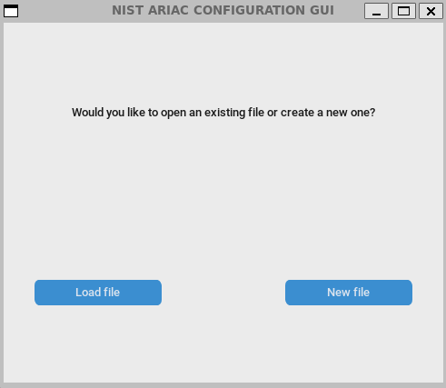

The first tab of the GUI lets you edit the header of the configuration file. This includes the time limit, the trial name, and the name of the author.

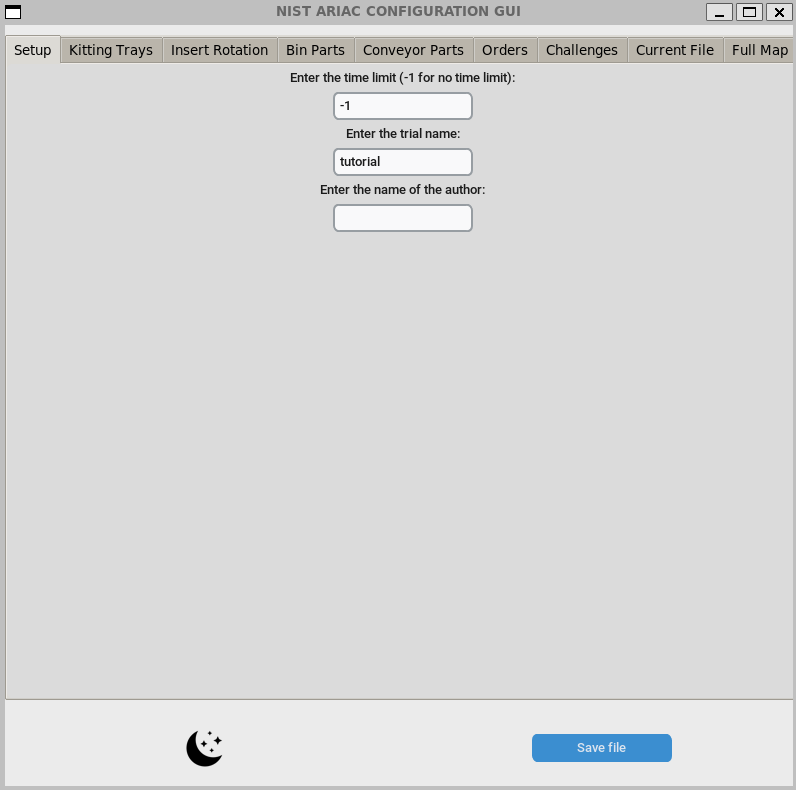

The second tab is the kitting trays menu. This menu lets you choose the kitting tray in each of the slots. 
When a kitting tray is selected, the kitting tray with the correct fiducial tag appears on the tables in the GUI.

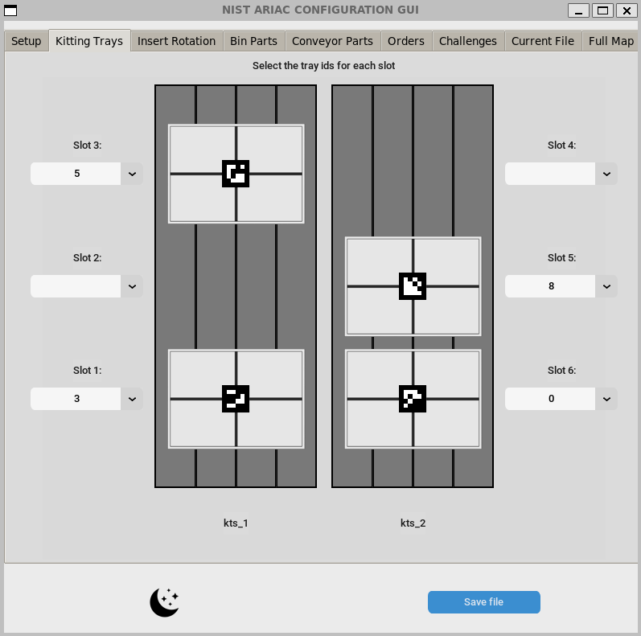

The third tab is the assembly insert rotation menu. 
At first, as long as a file with non-zero assembly insert rotations is not loaded in, this menu will be a button which states that all the inserts are currently set to 0.0.

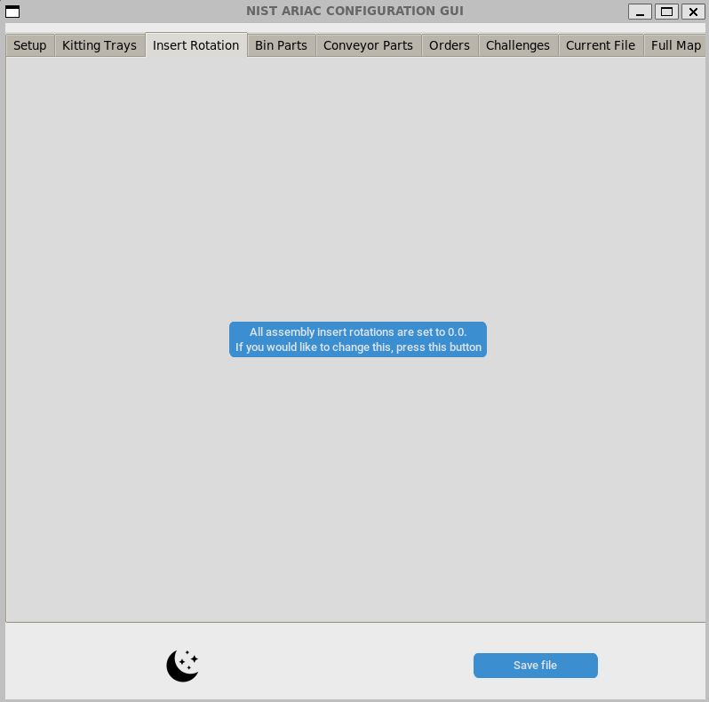

If this needs to be changed, press the button and four sliders appear, which allow you to change the rotation of each of the inserts.

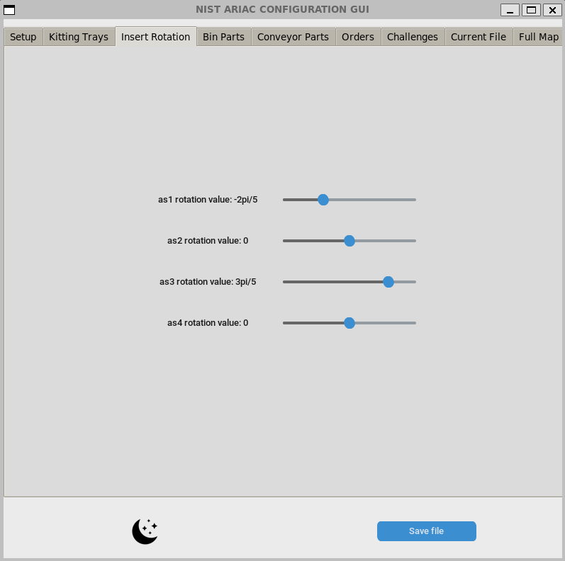

The fourth tab is the bin parts menu. At the top of this menu, there is a dropdown menu which changes the bin being edited.
On the left half of this menu, a diagram of the bin shows up with each slot acting as a button. 
If there is a part there, the button will be an image of the part with the correct rotation. If this part is clicked on, it can be edited.
If there is no part there, the button will be a plus sign. If this button is clicked, the add part menu will appear.
On the right half of the menu, is a minimap which shows each of the bins. The one currently being edited will show up in blue and the others will be white. This minimap also shows the parts currently on each bin.
Under the diagram and the minimap, there are two buttons. The top button allows for multiple parts to be added at the same time.
The second button clears the selected bin.

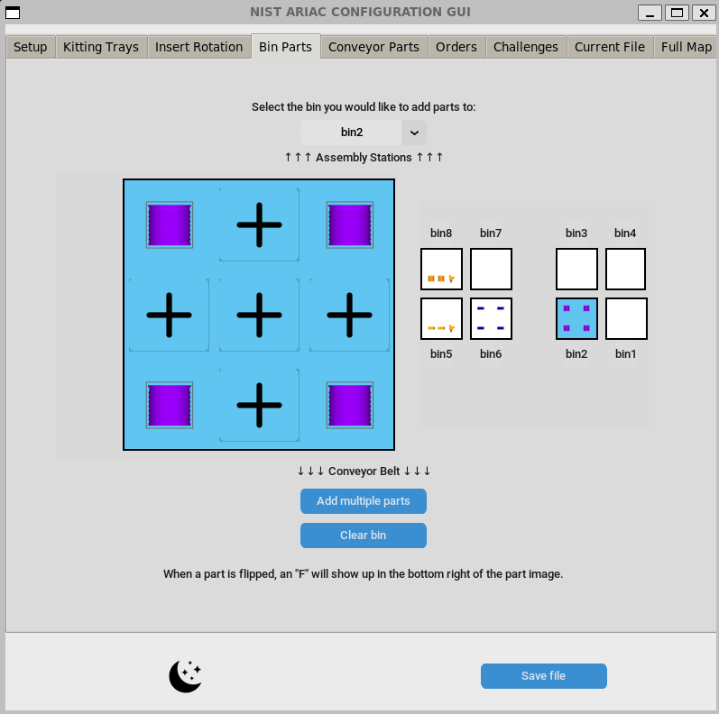

The fifth tab is the conveyor parts menu. The top half of this menu has the basic conveyor settings, like spawn rate and whether the order is random or sequential.
Under these options, there is an add part lot button, which adds parts to the conveyor belt.
Under these settings, there is a scrollable sub-window with a list of the part lots currently on the conveyor belt.
This list has buttons where the part lots can be edited or deleted.

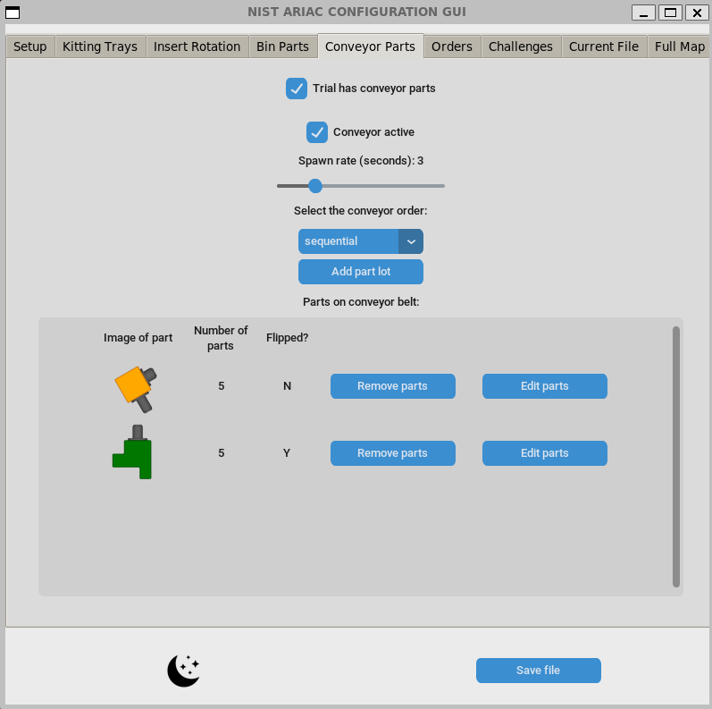

The sixth tab is the orders menu. There are three main buttons in this menu, the "Add kitting order", "Add assembly order",  and "Add combined order".
If any orders have already been created, a menu will show up under these buttons with edit and delete buttons.
If no kitting trays have been selected, the GUI will not be able to create a kitting order.

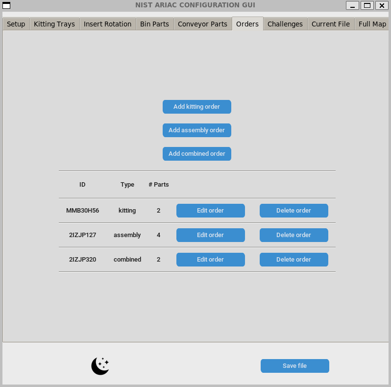

The seventh tab is the challenges menu. This menu can add any of the challenges available in the configuration file. 
Once challenges are made, they appear in a scrollable sub-window with edit and delete buttons for each of the challenges.

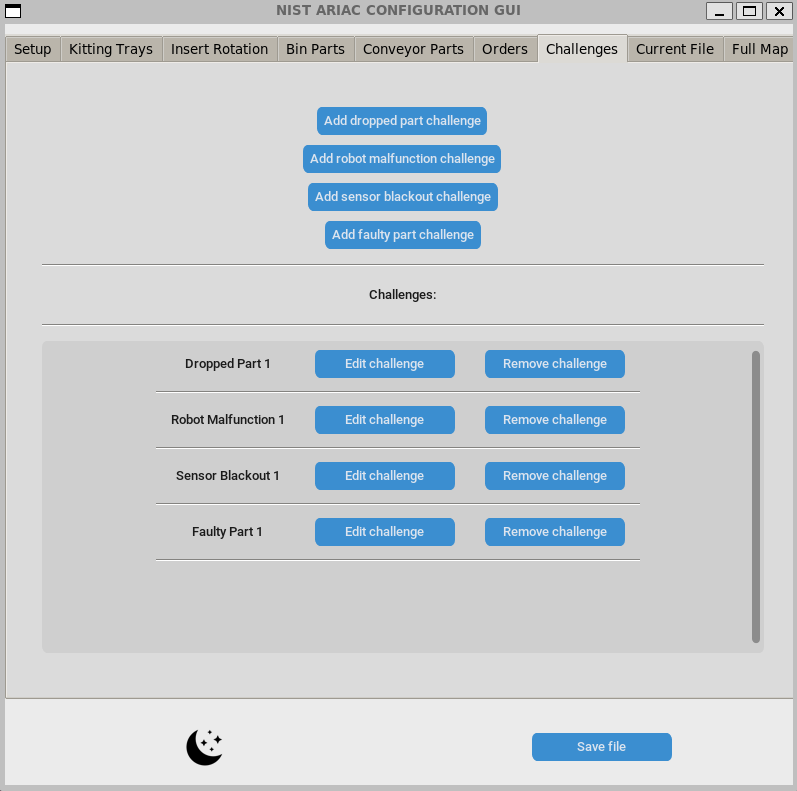

The eighth tab shows the current status of the file. This is created live any time a change is made in anypart of the GUI.
This tab shows the entirety of the configuration file.

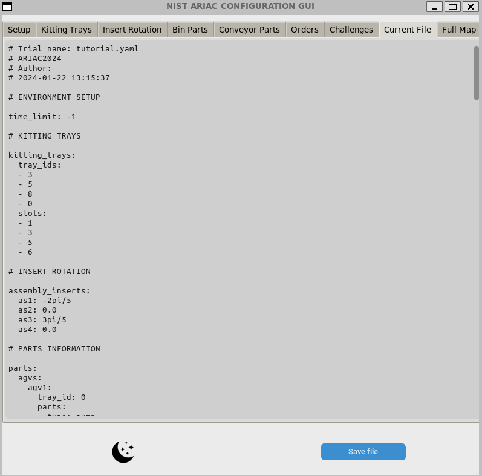

The final tab is a map of the environment which shows each every part present on the agvs, bins, and conveyor belt. It also shows the rotation of the assembly stations.
To show the conveyor belt parts, set the "Show conveyor_parts" checkbox to true. 
The parts will move across the conveyor belt. Any time a part is added, edited, or deleted on the conveyor belt, the checkbox will automatically turn off.

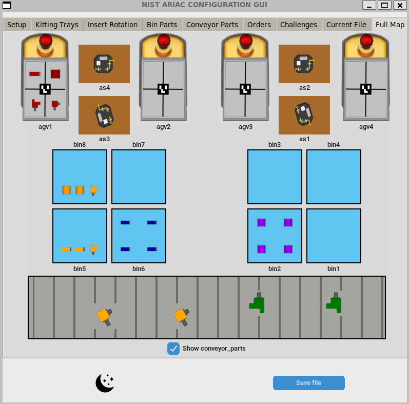

To save the file, press the "Save file" button in the bottom left. If you loaded in a file at the beginning, you will be asked if you want to overwrite that file. 

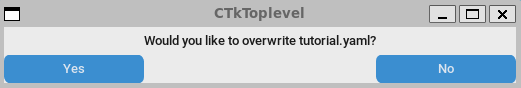

Otherwise, a file saving menu will appear.

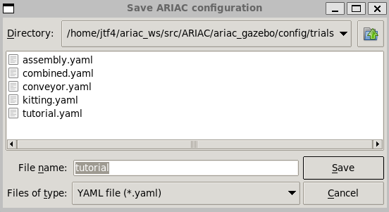

