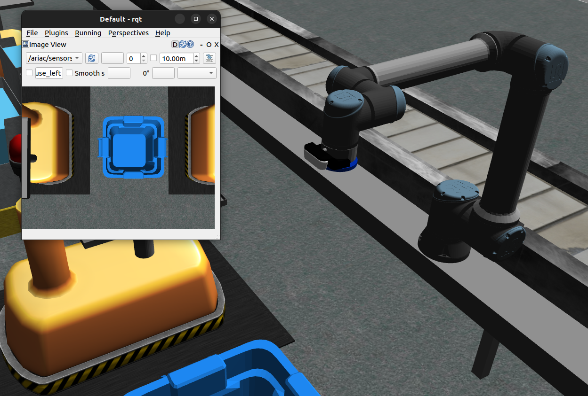

.. _SENSORS:

=======
Sensors
=======

There are two categories of sensors that competitors can utilize. 

The first type is static sensors. There are seven types of static sensors. These static sensors can be placed anywhere in the environment that competitors want. Each sensor publishes data to ROS topic(s) namespaced by the name of the sensor. More info can be found in :ref:`SENSOR_TOPICS` The sensors have no collision in the environment. 

The second type is robot sensors. Both the floor and ceiling robot can be equiped with either an RGB or RGBD camera. 

.. note:: 
  All sensors will not publish data to the ROS topics until the competition is started.

Sensor Costs
------------

There is a cost to each of the sensors. This cost will be factored in during the calculation of the final score. More details can be found in :ref:`SCORING`. 

.. list-table:: 
  :widths: 60 40
  :header-rows: 1
  :align: center

  * - Sensor Type
    - Cost
  * - Breakbeam
    - $100
  * - Proximity
    - $100
  * - Laser profiler
    - $200
  * - Lidar
    - $300
  * - RGB camera
    - $300
  * - RGBD camera
    - $500
  * - Basic logical camera
    - $500
  * - Robot RGB camera
    - $800
  * - Robot RGBD camera
    - $1000
  * - Advanced logical camera
    - N/A

Static sensors
--------------

Breakbeam sensor
================

The break beam sensor reports when a beam is broken by an object. It does not provide distance information.

.. image:: ../images/BreakBeam.png
  :width: 60%
  :align: center
  :alt: breakbeam sensor

Proximity sensor
================

The proximity sensor outputs how far an object is from the sensor.

.. image:: ../images/Proximity.png
  :width: 60%
  :align: center
  :alt: proximity sensor

Laser profiler
==============

The laser profiler provides an array of distances to a sensed object.

.. image:: ../images/LaserProfiler.png
  :width: 60%
  :align: center
  :alt: laser profiler sensor

Lidar
=====

The LIDAR sensor provides a point cloud of detected objects.

.. image:: ../images/Lidar.png
  :width: 60%
  :align: center
  :alt: lidar sensor

RGB camera
==========

The RGB camera provides an RGB image.

.. image:: ../images/RGBCamera.png
  :width: 60%
  :align: center
  :alt: RGB camera

RGBD camera
===========

The RGBD camera provides an RGB image and a depth image.

.. image:: ../images/RGBDCamera.png
  :width: 60%
  :align: center
  :alt: RGBD camera

Basic logical camera
====================

The basic logical camera provides a list of kit tray poses and a list of part poses. The type and the color of an object are not reported by this sensor.

.. image:: ../images/BasicLogicalCamera.png
  :width: 60%
  :align: center
  :alt: basic logical camera

Advanced logical camera
=======================

The advanced logical camera reports the pose, the type, and the color of a detected object.

.. image:: ../images/AdvancedLogicalCamera.png
  :width: 60%
  :align: center
  :alt: advanced logical camera 

.. caution::
  The advanced logical camera is not allowed to be used for the 2024 competition. It can still be enabled in development by using the :code:`dev_mode` launch argument. 

Robot Cameras
-------------

If the camera is enabled for either of the robots, it will show up attached the last link of the robot arm. If the RGB camera is enabled it will only publish an RGB image, if the RGBD is selected it will publish a depth image as well. The camera and mount have no collision so they do not need to be accounted for when planning the robot motions. 

