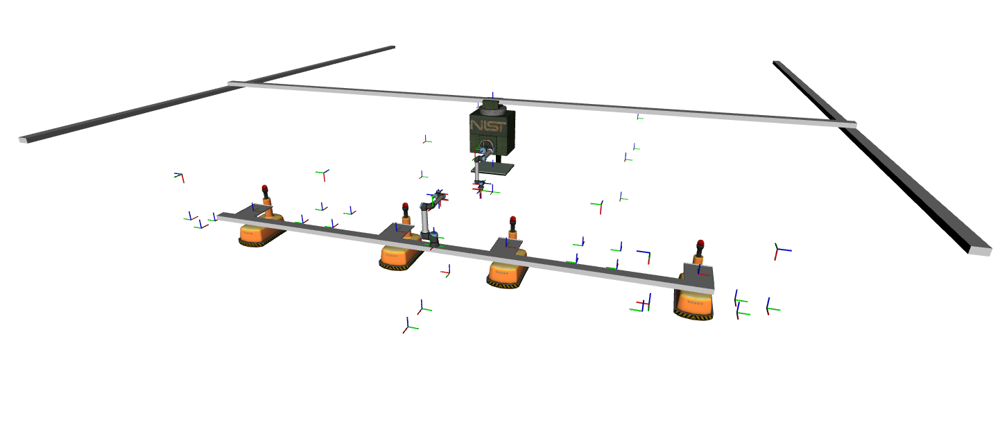

.. _TF_FRAMES:

=========
TF Frames
=========

The `TF2 transform library <https://docs.ros.org/en/iron/Concepts/Intermediate/About-Tf2.html>`_ is used in ARIAC to describe the transformation between all the relevant coordinates systems in the environment. The transformations describe the positions and orientations of various frames relative to a parent frame. 

To visualize the TF tree:

  1. Install the rqt-tf-tree package

    .. code-block:: sh

      sudo apt install ros-iron-rqt-tf-tree

  2. Run the rqt_tf_tree node

    .. code-block:: sh

      ros2 run rqt_tf_tree rqt_tf_tree

This will show the entire tree with all frames that are published. Many of the frames are static, meaning that they do not change over the course of the simulation. Others, such as the robot links and AGVs will update based on the actual positions. 

For information on how to get the transformations in your ROS node see the `TF2 tutorials <https://docs.ros.org/en/iron/Tutorials/Intermediate/Tf2/Tf2-Main.html>`_.

-----------------
List of TF Frames
-----------------

* **World**: The :tf:`world` frame is the root frame of the TF tree. It is located at the origin of the competition arena.

* **AGV Trays**: When placing kit trays onto AGVs competitors should use the :tf:`agv{n}_tray` frame where n is the agv number.

  .. code-block:: text

    world
    └─── agv1_track
    |    |
    |    └─── agv1_base
    |         |
    |         └─── agv1_tray
    └─── agv2_track
    |    |
    |    └─── agv2_base
    |         |
    |         └─── agv2_tray
    └─── agv3_track
    |    |
    |    └─── agv3_base
    |         |
    |         └─── agv3_tray
    └─── agv4_track
         |
         └─── agv4_base
              |
              └─── agv4_tray

* **Robots**: The robot state publisher updates the the tf frames for all the robot links

  .. code-block:: text

    world
    └─── long_rail_1 (frames for the ceiling robot)
    |    |
    |    └─── ...
    └─── slide_bar (frames for the floor robot)
         |
         └─── ...

* **Sensors**: A tf frame is published for all user added sensors. The naming convention is :tf:`{sensor_name}_frame`. All data reported from the sensor will be relative to this frame. The robot camera's will also have frames published if enabled. The naming convention is :tf:`ceiling_robot_camera_link` and :tf:`floor_robot_camera_link`.

  .. code-block:: text

    world
    └─── right_bins_camera_frame
    |
    └─── left_bins_camera_frame
    | 
    └─── ceiling_robot_camera_link

* **Bins**: The tf frames for the bins are located in the center of the bin surface. The frames are named as :tf:`bin{n}_frame` where n is the bin number.

  .. code-block:: text

    world
    └─── bin1_frame
    |
    └─── bin2_frame
    |
    └─── bin3_frame
    |
    └─── bin4_frame
    |
    └─── bin5_frame
    |
    └─── bin6_frame
    |
    └─── bin7_frame
    |
    └─── bin8_frame

* **Assembly inserts**: The tf frames for the inserts are located at the center of each insert. The frames are named as :tf:`as{n}_insert_frame` where n is the assembly station number. All pose data for assembly and combined tasks are relative to these frames. These frames are updated when the assembly stations are rotated. 

  .. code-block:: text

    world
    └─── as1_table_frame
    |    |
    |    └─── as1_insert_frame
    |
    └─── as2_table_frame
    |    |
    |    └─── as2_insert_frame
    |
    └─── as3_table_frame
    |    |
    |    └─── as3_insert_frame
    |
    └─── as4_table_frame
         |
         └─── as4_insert_frame

* **Kit Tray Stations/Tool Changer**: Each of the kit tray stations have tf frames for the center of the table surface which is useful for picking trays. These are name :tf:`kts{n}_table_frame` where n is the table number. TF frames are also provided for the tool changers attached to the table:
  
  * :tf:`kts{n}_tool_changer_parts_frame` is the frame of the tool changer for the parts gripper, where n is the table number.
  
  * :tf:`kts{n}_tool_changer_trays_frame` is the frame of the tool changer for the trays gripper, where n is the table number.

  .. code-block:: text

    world
    |
    └─── kts1_table_frame
    |    |
    |    └─── kts1_tool_changer_parts_frame
    |    |
    |    └─── kts1_tool_changer_trays_frame
    |
    └─── kts2_table_frame
         |
         └─── kts2_tool_changer_parts_frame
         |
         └─── kts2_tool_changer_trays_frame

* **Conveyor Belt**: There are two tf frames for the conveyor belt:
  
  * :tf:`conveyor_belt_base_frame` is the frame located below the conveyor belt.
  
  * :tf:`conveyor_belt_part_spawn_frame` is the frame origin where parts are spawn on the conveyor belt. This frame is located at one end of the conveyor belt.

  .. code-block:: text

    world
    |
    └─── conveyor_belt_base_frame
         |
         └─── conveyor_belt_part_spawn_frame

