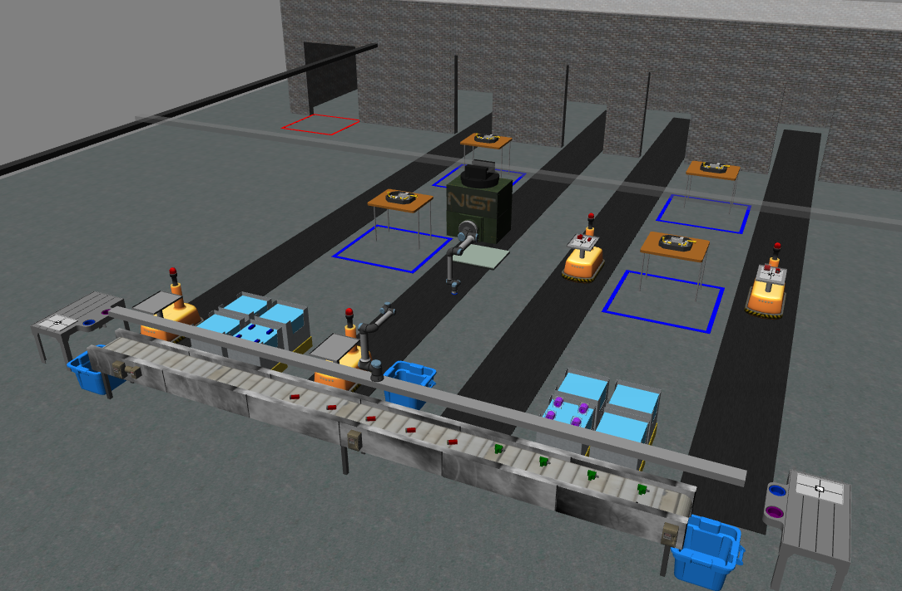

===================
ARIAC Documentation
===================

---------------------------------------------------------------------------------------------------------------------------------------
Welcome to `ARIAC 2024! <https://www.nist.gov/el/intelligent-systems-division-73500/agile-robotics-industrial-automation-competition>`_
---------------------------------------------------------------------------------------------------------------------------------------

The Agile Robotics for Industrial Automation Competition (ARIAC), put on by the National Institute of Standards and Technology (NIST), is an annual competition that tests the ability of robots to perform a series of tasks in a dynamic environment. The tasks are designed to test the robot's ability to perform pick-and-place operations, assembly, and kitting in a simulated warehouse. Agility in the context of ARIAC isn't just about a robot's physical capabilities or speed; it's about how adaptable, efficient, and autonomous it can be in a dynamic manufacturing environment. The competition serves as a testbed for developing algorithms that can be applied in real-world manufacturing settings. NIST uses the insights gained from the contest to shape standard metrics and test methods for future robotic agility in manufacturing.

------------------
ARIAC Repositories
------------------

* `ARIAC <https://www.github.com/usnistgov/ARIAC/>`_ (main repository)

* `ARIAC_evaluation <https://www.github.com/usnistgov/ARIAC_evaluation/>`_ (automated evaluation in docker)

* `ARIAC_docs <https://www.github.com/usnistgov/ARIAC_docs/>`_ (source code for this documentation)

* `ARIAC_tutorials <https://github.com/usnistgov/ARIAC_tutorials/>`_ (tutorials)

.. Hidden TOCs

.. toctree::
  :caption: ⏩ Getting Started
  :maxdepth: 3
  :hidden:

  getting_started/installation
  getting_started/changelog
  getting_started/registering
  getting_started/events

.. toctree::
  :caption: ⏩ Competition
  :maxdepth: 3
  :hidden:

  competition/terminology
  competition/overview
  competition/environment
  competition/orders
  competition/sensors
  competition/trials
  competition/ros_communication
  competition/challenges
  competition/tf_frames

.. toctree::
  :caption: ⏩ Evaluation
  :maxdepth: 3
  :hidden:

  evaluation/overview
  evaluation/scoring
  evaluation/launch_file_setup

.. toctree::
  :caption: ⏩ Tutorials
  :maxdepth: 3
  :hidden:

  tutorials/tutorials
  tutorials/tutorial_1
  tutorials/tutorial_2
  tutorials/tutorial_3
  tutorials/tutorial_4
  tutorials/tutorial_5
  tutorials/tutorial_6
  tutorials/tutorial_7
  tutorials/tutorial_8