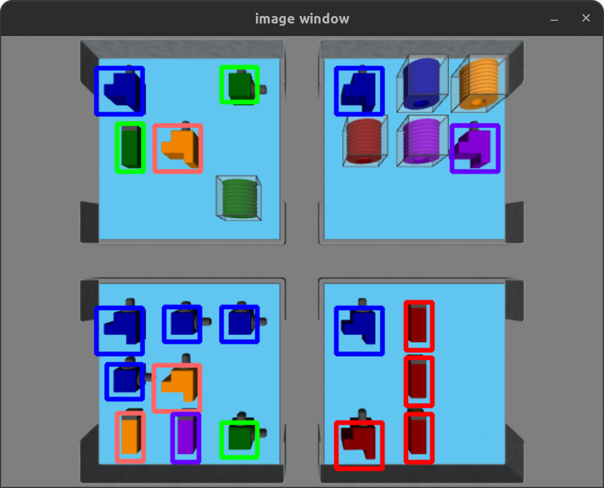
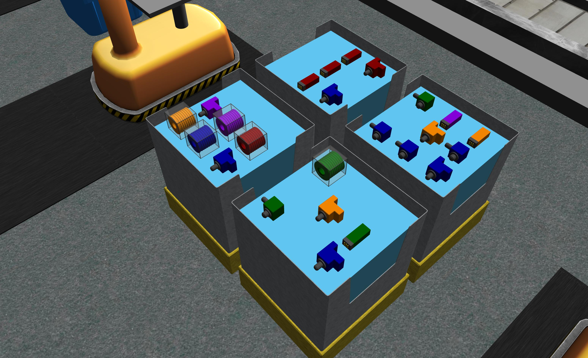
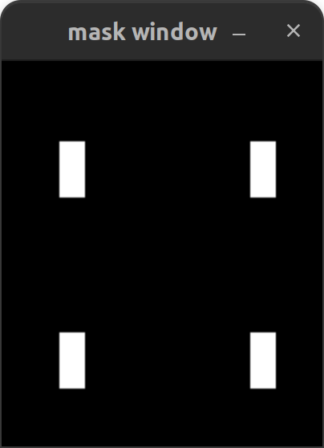
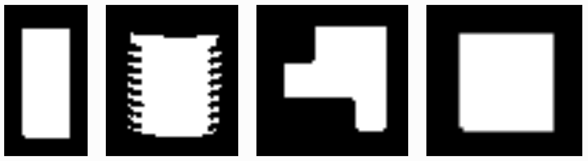
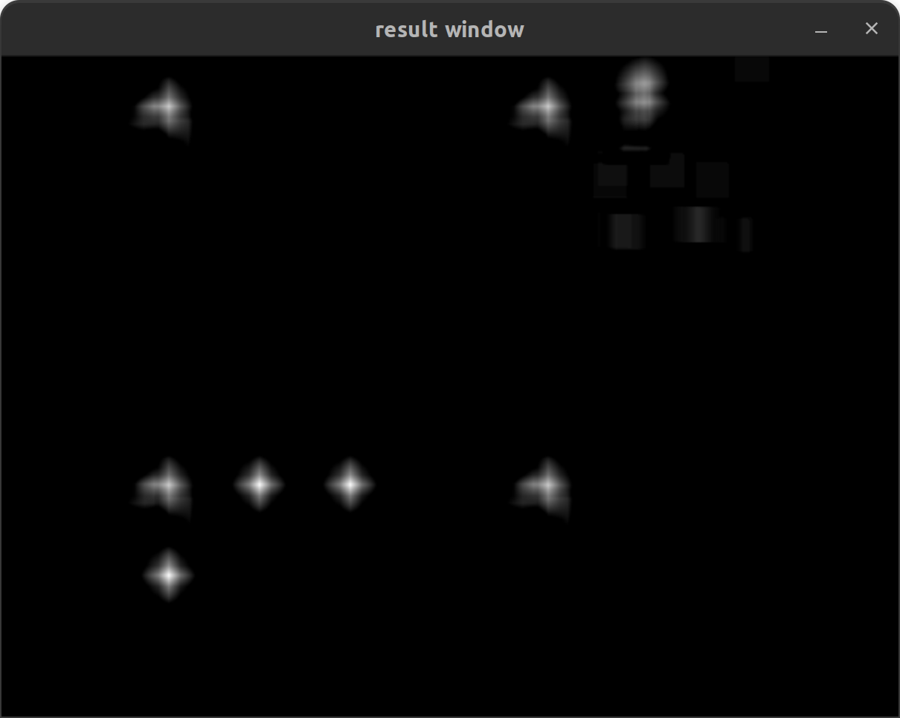

.. _TUTORIAL3:

===============================================
Tutorial 3: Processing Data from an RGBD Camera
===============================================

This tutorial shows how to use OpenCV to parse the RGB image from a camera to classify part type and color for parts in a bin.

---------------------------------------
Starting the environment for Tutorial 3
---------------------------------------

To start the enviornment, use this command:

.. code-block:: bash
        
    ros2 launch ariac_gazebo ariac.launch.py competitor_pkg:=ariac_tutorials trial_name:=tutorial dev_mode:=True

------------------
Running tutorial 3
------------------

To start tutorial 3, open a new terminal and use this command:

.. code-block:: bash
        
    ros2 launch ariac_tutorials tutorial.launch.py tutorial:=3

-----------------------------
Expected output of tutorial 3
-----------------------------

.. code-block:: console
    :caption: Tutorial 3 output
    :class: no-copybutton

    [tutorial_3.py-1] [INFO] [1705523791.505330909] [competition_interface]: Waiting for competition to be ready
    [tutorial_3.py-1] [INFO] [1705523812.096887359] [competition_interface]: Competition state is: idle
    [tutorial_3.py-1] [INFO] [1705523926.539425501] [competition_interface]: Competition state is: ready
    [tutorial_3.py-1] [INFO] [1705523926.561503733] [competition_interface]: Competition is ready. Starting...
    [tutorial_3.py-1] [INFO] [1705523926.610670594] [competition_interface]: Started competition.
    [tutorial_3.py-1] [INFO] [1705523926.613540083] [competition_interface]: Getting parts from bin 2
    [tutorial_3.py-1] [INFO] [1705523926.616115248] [competition_interface]: No image received yet
    [tutorial_3.py-1] [INFO] [1705523927.618836767] [competition_interface]: No image received yet
    [tutorial_3.py-1] [INFO] [1705523928.144099448] [competition_interface]: Competition state is: started
    [tutorial_3.py-1] [INFO] [1705523928.632360416] [competition_interface]: No image received yet
    [tutorial_3.py-1] [INFO] [1705523929.636587739] [competition_interface]: No image received yet
    [tutorial_3.py-1] [INFO] [1705523931.862293284] [competition_interface]: Slot 1: purple pump
    [tutorial_3.py-1] [INFO] [1705523931.864624017] [competition_interface]: Slot 2: Empty
    [tutorial_3.py-1] [INFO] [1705523931.866752218] [competition_interface]: Slot 3: purple pump
    [tutorial_3.py-1] [INFO] [1705523931.869826096] [competition_interface]: Slot 4: Empty
    [tutorial_3.py-1] [INFO] [1705523931.872064874] [competition_interface]: Slot 5: Empty
    [tutorial_3.py-1] [INFO] [1705523931.874144258] [competition_interface]: Slot 6: Empty
    [tutorial_3.py-1] [INFO] [1705523931.877048187] [competition_interface]: Slot 7: purple pump
    [tutorial_3.py-1] [INFO] [1705523931.880235581] [competition_interface]: Slot 8: Empty
    [tutorial_3.py-1] [INFO] [1705523931.883262169] [competition_interface]: Slot 9: Empty
    [tutorial_3.py-1] [INFO] [1705523931.886214625] [competition_interface]: Ending competition
    [tutorial_3.py-1] [INFO] [1705523931.923620397] [competition_interface]: Ended competition.

--------------------
Output Visualization
--------------------

When :python:`interface.display_bounding_boxes` is set to :python:`True` the 
part detection results can be visualized with bounding boxes overlayed on the
initial image of the selected bin.

The processed images are published on :python:`/ariac/sensors/display_bounding_boxes`

Use rqt to bring up an image viewer.

.. code-block:: python

    ros2 run rqt_image_view rqt_image_view

    Fig: Part Detection Results

-------------------------------
Code explanation for Tutorial 3
-------------------------------

This is the node used for tutorial 3. The functions from competition_interface.py which are used are highlighted.

.. code-block:: python
    :caption: :file:`tutorial_3.py`
    :name: tutorial_3
    :emphasize-lines: 20,22,29

    #!/usr/bin/env python3
    import rclpy
    import threading
    from rclpy.executors import MultiThreadedExecutor
    from ariac_tutorials.competition_interface import CompetitionInterface
    from time import sleep

    def main(args=None):
        rclpy.init(args=args)
        interface = CompetitionInterface(enable_moveit=False)
        executor = MultiThreadedExecutor()
        executor.add_node(interface)

        spin_thread = threading.Thread(target=executor.spin)
        spin_thread.start()
        interface.start_competition()

        # Turns on a debug topic to visualize bounding boxes and slots
        # /ariac/sensors/display_bounding_boxes
        interface.display_bounding_boxes = True
        
        bin_number = 6

        interface.get_logger().info(f"Getting parts from bin {bin_number}")
        bin_parts = None
        
        while rclpy.ok():
            try:
                bin_parts = interface.get_bin_parts(bin_number)
                
                # bin_parts will be None until image processing starts
                if bin_parts is None:
                    interface.get_logger().info(f"Waiting for camera images ...")
                    sleep(1)
                else:
                    for _slot_number, _part in bin_parts.items():
                        # Check if the bin is empty
                        if _part is None:
                            interface.get_logger().info(f"Bin {bin_number} is empty.")
                            break
                        else:
                            if _part.type is None:
                                interface.get_logger().info(f"Slot {_slot_number}: Empty")
                            else:
                                interface.get_logger().info(f"Slot {_slot_number}: {_part.color} {_part.type}")

                interface.get_logger().info(f"---")

            except KeyboardInterrupt:
                
                break
        
        interface.end_competition()
        interface.destroy_node()
        rclpy.shutdown()

    if __name__ == '__main__':
        main()

This tutorial demonstrates how part characteristics can be extracted from 
image data published by the RGB cameras in ARIAC. Once the trivial steps to 
collect data are taken, the image processing steps can be replaced with
an approach of the competitors' choosing to extract more information from the
image. Tutorial 3 contains two configurable settings: the bin number that will 
be checked for parts and a flag to turn on a visualization of the printed 
result. The output lists the type and colour of the part in each slot or states
'Empty' if unoccupied.

Collecting and Handling Image Data
----------------------------------

The RBG and RGBD cameras - through the use of plugins - publish data to 
multiple topics. The topic with the image matrix is 
:python:`/ariac/sensors/<SENSOR_NAME>/rgb_image`. Notice the QoS profile 
setting. The value of this arguement is an import starting point for 
troubleshooting when your subscriber appears to not receive data.

.. code-block:: python

    self.right_bins_RGB_camera_sub = self.create_subscription(ImageMsg,
                                                                "/ariac/sensors/right_bins_RGB_camera/rgb_image",
                                                                self._right_bins_RGB_camera_cb,
                                                                qos_profile_sensor_data,
                                                                )
    self.left_bins_RGB_camera_sub = self.create_subscription(ImageMsg,
                                                                "/ariac/sensors/left_bins_RGB_camera/rgb_image",
                                                                self._left_bins_RGB_camera_cb,
                                                                qos_profile_sensor_data,
                                                                )

Camera images from sensor topics are in a ROS message format and are not 
compatible with OpenCV Matrix types. The ROS2 :python:`cv_bridge` package 
allows for efficient conversion between image messages and OpenCV matrices.

.. code-block:: python

    self._bridge = CvBridge()

The most recent image from each of the subscribed sensors is stored in an 
instance variable. This is done  with the :python:`imgmsg_to_cv2` function. 
:python:`bgr8` is the canonical OpenCV format. It is important to specify the 
image encoding because the default format used by the RGB cameras is 
:python:`rgb8`.

.. code-block:: python

    def _left_bins_RGB_camera_cb(self, msg: ImageMsg):
        try:
            self._left_bins_camera_image = self._bridge.imgmsg_to_cv2(msg, "bgr8")
        except CvBridgeError as e:
            print(e)

    Fig: Gazebo View

.. figure:: ../images/tutorial_3/camera_view.png
    :height: 400px
    :align: center

    Fig: Camera View

Image Processing
----------------

The goal of this stage is to take in an RGB camera image and 
return a list of parts in the image. The parts should be identified by colour and 
type. :python:`get_bin_parts` when called, picks one of the stored images based
on the bin number argument and searches it for parts. The image is cropped for
efficiency down to the bin that is needed. 

.. code-block:: python

    def get_bin_parts(self, bin_number: int):
        '''
        return slot occupancy list
        '''
        if type(self._left_bins_camera_image) == type(np.ndarray([])) and \
            type(self._right_bins_camera_image) == type(np.ndarray([])):
            if bin_number > 4:
                cv_img = self._left_bins_camera_image
            else:
                cv_img = self._right_bins_camera_image

            imgH, imgW = cv_img.shape[:2]
            
            # roi based on bin number
            if bin_number == 1 or bin_number == 6:
                # bottom left
                cv_img = cv_img[imgH//2:, (imgW//2)+20:imgW-100]
            if bin_number == 2 or bin_number == 5:
                # bottom right
                cv_img = cv_img[imgH//2:, 100:(imgW//2)-20]
            if bin_number == 3 or bin_number == 8:
                # top left
                cv_img = cv_img[:imgH//2, 100:(imgW//2)-20]
            if bin_number == 4 or bin_number == 7:
                # top right
                cv_img = cv_img[:imgH//2, (imgW//2)+20:imgW-100]

The search for parts, implemented in :python:`find_parts`, does the following:

- HSV Colour Masking
- Template Matching (Cross Correlation)
- Non-Maximum Suppression

There are 5 possible part colours and 4 possible part types. Parts are found 
by inspecting the image, once for each colour-type combination. First, the 
image is changed from the BGR to HSV colour space to gain some degree of lighting 
invariance. To pick out parts of a chosen colour, predetermined upper and 
lower bounds of the HSV values for the colour are specified to 
the :python:`cv2.inRange` function which masks out everything but the parts of 
that colour. The colour bounds are chosen such that only the tops of the parts
are unmasked which is necessary for next step.

.. code-block:: python

    def find_parts(self, img):
        '''
        image processing
        ''' 
        # hsv masking
        imgHSV = cv2.cvtColor(img, cv2.COLOR_BGR2HSV)

        for color in self.part_poses.keys():
            for type in self.part_poses[color].keys():

                # colour filtering
                imgMask = cv2.inRange(imgHSV, 
                                    self.colorBound(color, "lower"), 
                                    self.colorBound(color, "upper"))

These values can be emperically determined. This online tool can help with 
tuning HSV values: `Online HSV Mask Tool <https://pseudopencv.site/utilities/hsvcolormask/>`_.

.. code-block:: python

    HSVcolors = {
    "red"    : {"hmin":   0, "smin":  10, "vmin": 115, "hmax":   4, "smax": 255, "vmax": 255},
    "green"  : {"hmin":  57, "smin":   0, "vmin":   0, "hmax":  80, "smax": 255, "vmax": 255},
    "blue"   : {"hmin": 116, "smin":   0, "vmin": 134, "hmax": 121, "smax": 255, "vmax": 255},
    "orange" : {"hmin":  14, "smin":   0, "vmin": 200, "hmax":  21, "smax": 255, "vmax": 255},
    "purple" : {"hmin": 130, "smin": 180, "vmin": 160, "hmax": 150, "smax": 255, "vmax": 255}
    }

    Fig: Image Masking (Blue Parts)

The second step is to find the types of parts in the masked image. This is done 
by taking an image of a known part as template and searching the masked image 
for places that match the template. Since the image is an 8-bit 
single channel masked image, the template of the part needs to be in the same 
format. These images can be created and stored off-line since part appearences
are not subject to change. This code snipped shows how the images are loaded 
when the node is initialized. Missing templates will stop normal operation.

.. code-block:: python

  def load_part_templates(self):
    self.sensor_template = cv2.imread(
        "install/part_detector/share/part_detector/part_detector_assets/partTemplateMasks/sensor.png", cv2.IMREAD_GRAYSCALE)
    self.regulator_template = cv2.imread(
        "install/part_detector/share/part_detector/part_detector_assets/partTemplateMasks/regulator.png", cv2.IMREAD_GRAYSCALE)
    self.battery_template = cv2.imread(
        "install/part_detector/share/part_detector/part_detector_assets/partTemplateMasks/battery.png", cv2.IMREAD_GRAYSCALE)
    self.pump_template = cv2.imread(
        "install/part_detector/share/part_detector/part_detector_assets/partTemplateMasks/pump.png", cv2.IMREAD_GRAYSCALE)
          
    if (not self.sensor_template.shape[0] > 0) or \
      (not self.regulator_template.shape[0] > 0) or \
      (not self.battery_template.shape[0] > 0) or \
      (not self.pump_template.shape[0] > 0):
      return False
    return True
    

    Fig: Part Templates

The :python:`matchTemplate` function searches the masked image
for the template. The function takes in the masked image, the queried type and 
colour. The colour of the parts in the image is known at this stage but is 
included to write out results. :python:`cv2.matchTemplate` performs 
cross-correlation of the template over the masked image and returns a 
confidence map. The highest confidence values are the likely locations of parts
in the image. If the threshold is too high it causes some parts to be missed. A 
low threshold results in duplicate results for the location of the same part.
Duplication is mostly solved with non maximum suppression which picks out the highest 
confidence points when there are overlapping detections. The coordinates in the result
correspond to the top-left of the template at the position where the template
best matches the underlying image, in line with OpenCV's image frame 
conventions. Since it is more convenient to know the center of the part 
location, the final coordinates are translated by half the template's height 
and width.

.. code-block:: python

    def matchTemplate(self, imgMask, color, type):
        # template matching
        if type == "pump":
            tH, tW = self.pump_template.shape#[:2]
            matchField = cv2.matchTemplate(imgMask, self.pump_template, cv2.TM_CCOEFF_NORMED)
        elif type == "battery":
            tH, tW = self.battery_template.shape#[:2]
            matchField = cv2.matchTemplate(imgMask, self.battery_template, cv2.TM_CCOEFF_NORMED)
        elif type == "sensor":
            tH, tW = self.sensor_template.shape#[:2]
            matchField = cv2.matchTemplate(imgMask, self.sensor_template, cv2.TM_CCOEFF_NORMED)
        elif type == "regulator":
            tH, tW = self.regulator_template.shape#[:2]
            matchField = cv2.matchTemplate(imgMask, self.regulator_template, cv2.TM_CCOEFF_NORMED)

        # match many
        (yy, xx) = np.where(matchField >= 0.80)

        raw_matches = []
        for (x, y) in zip(xx, yy):
            raw_matches.append((x, y, x+tW, y+tH))

        # non-max suppression
        refined_matches = []
        refined_matches = non_max_suppression(np.array(raw_matches))

        # do this once to save divisions
        htH, htW = tH//2, tW//2
        centered_refined_matches = []
        for sx, sy, _, _ in refined_matches:
            centered_refined_matches.append((sx + htW, sy + htH))

        # store results
        self.part_poses[color][type] = refined_matches
        self.centered_part_poses[color][type] = centered_refined_matches

    Fig: Template Matching Result(Blue Parts)

The list of results of part locations are written into a dictionary that stores
part locations by colour and type that is allocated when the node is initialized.

.. code-block:: python

    part_poses = {
        "red"    : {"battery": [], "pump": [], "sensor": [], "regulator": []},
        "green"  : {"battery": [], "pump": [], "sensor": [], "regulator": []},
        "blue"   : {"battery": [], "pump": [], "sensor": [], "regulator": []},
        "orange" : {"battery": [], "pump": [], "sensor": [], "regulator": []},
        "purple" : {"battery": [], "pump": [], "sensor": [], "regulator": []}
    }

At this stage, the pose of the parts can be computed if needed. The sensor 
position is clearly known. The position of all the parts in the image are 
known, the bounds of the image's field of view can be emperically determined 
and used to map the image coordinates to world coordinates.

Reporting Results
-----------------
the pixels of the bin are mapped to slot numbers and each slot is assigned a
part if one is present.

.. code-block:: python

    def output_by_slot(self):
        bin = dict([(i, None) for i in range(1, 10)])
        for color in self.centered_part_poses.keys():
            for type in self.centered_part_poses[color].keys():
               for (csx, csy) in self.centered_part_poses[color][type]:
                    row = 0
                    # slot 1, 2, 3
                    if csy <= 88:
                        row = 1                        
                    # slot 7, 8, 9
                    elif csy >= 151: 
                        row = 3
                    # slot 4, 5, 6
                    else: #csy > 88 and csy < 151:
                        row = 2
                    col = 0
                    if csx <= 68:
                        col = 1
                    elif csx >= 131:
                        col = 3
                    else: # csx > 68 and csx < 131:
                        col = 2
                    
                    bin[self.slot_mapping[(row, col)]] = PartMsg(color=color, type=type)
                    for k, v in bin.items():
                        if v is None:
                            bin[k] = PartMsg(color=None, type=None)
        return bin

.. warning:: 

    The image processing pipeline used for this tutorial only works for parts that are not rotated.

.. warning:: 

    Pumps might not always be detected.
